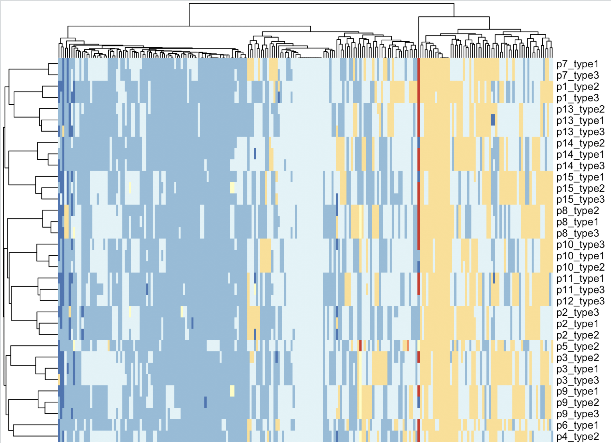
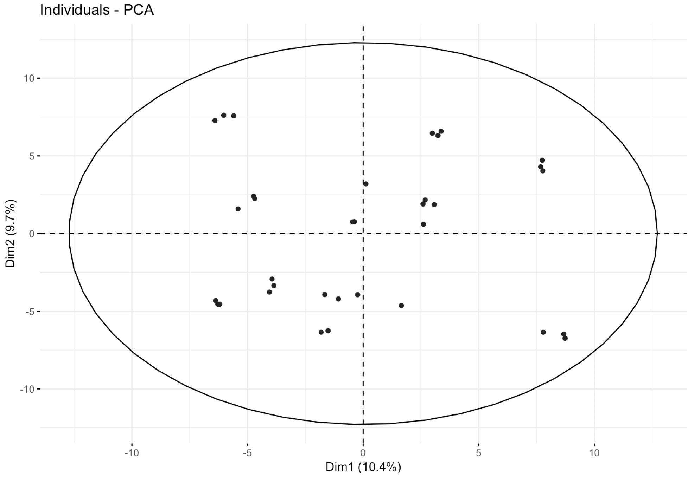
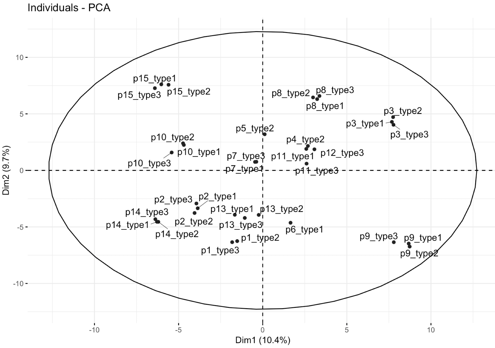

# Run PCA for a vcf files(GATK joint calling results)

Once you finished the[ GATK best pratice](https://software.broadinstitute.org/gatk/best-practices/workflow?id=11145) for a group of DNA data , a VCF file will be generated.

- https://software.broadinstitute.org/gatk/best-practices/workflow?id=11145 

Follow this, you can load the VCF file into R, and do PCA to seperate them,  to check how close your samples are. 

Please read the  [documents](files/VCFv4.2.pdf) by yourself if you are not familar with VCF format. 

We will use the depth-dependent correlation models of allele fractions of known single-nucleotide polymorphisms (SNPs) offered by [NGSCheckMate](https://github.com/parklab/NGSCheckMate)

### step1: load the vcf file into R 

```r
## you can download the vcf file from 1000 genomes project.
if(F){
  library(vcfR)
  vcf_file='/gatk/germline/merge.vcf'
  ### 直接读取群体gvcf文件即可 
  vcf <- read.vcfR( vcf_file, verbose = FALSE )
  save(vcf,file = 'example_vcf.Rdata')
} 
f='example_vcf.Rdata'
load(file = f)
vcf@fix[1:4,1:4]
vcf@gt[1:14,1:4]
colnames(vcf@gt)
```

### step2: load the selected SNP positions into R

````r
bed=read.table('SNPbeds/SNP_GRCh38_hg38_wChr.bed',header = F,stringsAsFactors = F)
bed[,2]=trimws(bed[,2])
bed[,3]=trimws(bed[,3])
# please make sure that which column is the position in your vcf file.
# In this case, it's second column, but in your case, it might be third column.
# so use bed[,c(1,3)] instead of bed[,c(1,2)]
need_pos=apply( bed[,1:2] ,1,function(x) paste0(x,collapse = '-'))
all_pos=apply( vcf@fix[,1:2] ,1,function(x) paste0(x,collapse = '-'))
table(all_pos %in% need_pos )
filter_vcf=vcf[all_pos %in% need_pos ]
filter_vcf

````

### step3: get the genotype information matrix for all the samples 

```r
library(stringr)
tmp_f <- function(x){
  #x=vcf@gt[,2]
  x
  gt=str_split(x,':',simplify = T)[,1]
  ad=str_split(str_split(x,':',simplify = T)[,2],',',simplify = T)[,2]
  dp=str_split(x,':',simplify = T)[,3]
  return(gt)
  # return(data.frame(gt=gt,dp=as.numeric(dp),ad=as.numeric(ad)))
}
all_samples=colnames(filter_vcf@gt)[2:length(colnames(filter_vcf@gt))]
gt_mat <- do.call(cbind,lapply(all_samples, function(x){
  y=filter_vcf@gt[,x]
  y
  tmp_f(y)
}))
colnames(gt_mat)=all_samples
gt_mat[1:4,1:4]
```

### step4: change the genotype to numeric value

just try it, it might no be reasonable 

```r

str(gt_mat) 
dat=as.factor(gt_mat)
dat=as.numeric(dat)
dat[1:4]
dat=matrix(dat,nrow = nrow(gt_mat))
dat[1:4,1:4]
colnames(dat)=all_samples
dat=t(dat)
dat=as.data.frame(dat) 
pheatmap::pheatmap(dat,show_colnames = F)
```

 the figure looks good, the different data from same sample are grouped together as below:

 


### step5: Do PCA for the genotype information matrix

```r
dat[1:4,1:4] 
library("FactoMineR")
library("factoextra")  
dat.pca <- PCA(dat , graph = FALSE)
fviz_pca_ind(dat.pca, repel =T,
             geom = c("point", "text"), # show points only (nbut not "text")
             #col.ind = dat$plate, # color by groups
             #palette = c("#00AFBB", "#E7B800"),
             addEllipses = TRUE, # Concentration ellipses
             legend.title = "Groups"
) 

```

before we add the sample information, see below:




some samples are grouped together, then we add the sample information, see below:



Good result, the different data from same sample are grouped together. 